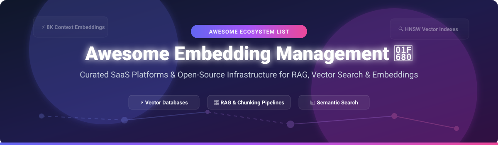

# 🚀 Awesome Embedding Management

  
  
  
  
  

## 🌟 Top Embedding Management Platforms Ecosystem

**Curated List of SaaS Products & Open-Source GitHub Projects**  
*Focused on Embedding Generation, Vector Storage, RAG Pipelines & Semantic Search Infrastructure*  

**Last updated: September 2026**

---

Welcome to **Awesome Embedding Management**! 🚀 This repository tracks top **SaaS platforms** and **open-source projects** for **Embedding Management**, **Vector Databases**, **RAG Pipelines**, and **Semantic Search Infrastructure**. These infrastructure tools enable developers, data teams, and AI engineers to transform text, code, audio, and images into high-dimensional vector embeddings, index them efficiently, scale vector search, and build robust retrieval-augmented generation (RAG) applications.

Whether you need managed API-first platforms or self-hosted open-source vector infrastructure without per-vector SaaS pricing, this guide covers the entire landscape. 💡

---

## 📌 Table of Contents

- [☁️ SaaS/Hosted Platforms](#️-saashosted-platforms)
- [⚡ Open-Source GitHub Projects](#-open-source-github-projects)
- [🤝 How to Contribute](#-how-to-contribute)
- [☕ Support & Sponsorship](#-support--sponsorship)
- [📈 Star History](#-star-history)
- [⚠️ Disclaimer](#️-disclaimer)

---

## ☁️ SaaS/Hosted Platforms

> 💡 **Market Size & Industry Structure**: The global vector database and embedding management market is estimated at **$1.8B to $2.5B in 2026** and is projected to surpass **$6.5B by 2030** (CAGR ~32%). The sector is **moderately fragmented**: hyper-scalers (Cohere, LangChain ecosystem) command enterprise platform spend, while specialized vector search engines (Marqo, Jina AI, Vectorize) innovate rapidly across multimodal embeddings, long-context parsing, and real-time agent memory.

Below is a curated comparison of leading SaaS embedding management products, sorted by **Market Size / Valuation / Funding scale (descending)** 📊:

| Platform | Description | Pricing Model & Starting Tier | Free Tier Limits | Market Size / Valuation Scale |
| :--- | :--- | :--- | :--- | :--- |
| 🌐 **[Cohere Embed Platform](https://cohere.com/)** | Enterprise embedding API with strong multilingual, long-context (Embed v4/v5), and fine-tuning capabilities. | Starts at $0.12 per 1M tokens (Embed 4). | Trial API Key (Free for testing, rate-limited to 100 RPM). | 🦄 **~$7.0 Billion Valuation** ($2.34B Total Funding) |
| 🦜 **[LangChain (LangSmith)](https://www.langchain.com/)** | LLM framework & production SaaS platform for RAG observability, evaluation, and embedding pipeline management. | Plus tier starts at $39/seat/month + usage costs. | Developer Free Tier (1 seat, 5,000 base traces/month). | 🦄 **~$1.3 Billion Valuation** ($260M+ Total Funding) |
| 📑 **[Unstructured](https://unstructured.io/)** | Enterprise document ingestion & processing API for RAG, partitioning PDFs, HTML, & images prior to embedding generation. | Starts at $0.03 per page processed. | Free SaaS API Tier (10,000 pages free upon sign-up). | 🏢 **~$230 Million Valuation** ($65M Total Funding) |
| 🦙 **[LlamaIndex (LlamaCloud)](https://www.llamaindex.ai/)** | Data framework and managed cloud parsing/indexing platform (LlamaParse & LlamaExtract) for complex RAG pipelines. | Pay-as-you-go overages after free quota; custom Enterprise plans. | Free Developer Tier (10,000 extraction credits/month). | 🏢 **~$75 Million Valuation** (Series A Funding) |
| 🦊 **[Jina AI](https://jina.ai/)** | Multimodal embedding API & search foundation platform supporting text, code, images, and long-context (8K) embeddings. | Pay-as-you-go token top-up after free token tier. | 10 Million free tokens upon sign-up (500 RPM rate limit). | 🏢 **~$50 Million Valuation** ($38M+ Total Funding) |
| ⚡ **[Vectorize](https://vectorize.io/)** | Managed serverless RAG platform and agent memory ("Hindsight") that automates extraction, indexing, & retrieval. | Starter / Pro plan starts at $249/month for advanced graph features. | Free Developer Cloud Sandbox for pipeline prototyping. | 🚀 **~$20 Million Valuation** (Early-Stage Venture Funded) |
| 🎯 **[Haystack (deepset)](https://haystack.deepset.ai/)** | Enterprise NLP framework & Deepset Cloud platform for semantic search, QA, and embedding pipeline management. | Custom Enterprise deployment plans; Starter tier available. | 14-day free enterprise cloud trial available upon request. | 🚀 **~$20 Million Valuation** ($14M Funding raised) |
| 🌊 **[Flowise](https://flowiseai.com/)** | Low-code visual builder for RAG pipelines, embedding nodes, and vector store orchestration. | Managed cloud starts at ~$35/month (Note: Acquired by Workday). | Free Cloud Tier (2 flows, 100 predictions/month; OS version free). | 🏢 **Acquired by Workday (2025)** |
| 📐 **[Marqo](https://www.marqo.ai/)** | Multimodal vector search platform with end-to-end vector generation, storage, and hybrid search in a single API. | Managed Cloud starts via sales contact / dedicated instance pricing. | 14-day hosted proof-of-concept trial via sales request. | 🚀 **Early-Stage Venture Backed** (Series A) |
| 🔗 **[EmbedChain](https://embedchain.ai/)** | Framework for building RAG applications with minimal code; powers LLM data chunking and vector storage (Mem0 ecosystem). | Pay-as-you-go for underlying LLM / vector store infrastructure. | Free open-source core framework (Apache-2.0). | 🚀 **Early-Stage Developer Startup** |

---

## ⚡ Open-Source GitHub Projects

These open-source tools provide complete self-hosted vector infrastructure, custom embedding pipelines, and data privacy without per-vector SaaS pricing.

Sorted by **GitHub Stars_Count (descending)** 🌟:

1. 🦜 **[LangChain](https://github.com/langchain-ai/langchain)**   
   Building applications with LLMs through composable memory, vector stores, chunking strategies, and embedding integrations. Python/JS. MIT. 🛠️

2. 🦙 **[LlamaIndex](https://github.com/run-llama/llama_index)**   
   Data framework for LLM applications providing data connectors, vector index structures, and retrieval-augmented generation (RAG) components. MIT. 📦

3. ⚡ **[Milvus](https://github.com/milvus-io/milvus)**   
   Cloud-native vector database built for enterprise AI workloads, supporting billions of high-dimensional vectors with decoupled query and index nodes. Go/C++. Apache-2.0. 🏢

4. 🎯 **[Qdrant](https://github.com/qdrant/qdrant)**   
   High-performance, production-ready vector similarity search engine written in Rust with rich payload filtering and hybrid search. Apache-2.0. 🦀

5. 💎 **[Chroma](https://github.com/chroma-core/chroma)**   
   AI-native open-source embedding database for building Python/JS LLM applications with built-in embeddings and document storage. Apache-2.0. 🎨

6. 🔍 **[Weaviate](https://github.com/weaviate/weaviate)**   
   Open-source vector database storing vector embeddings alongside object properties. Supports automatic vectorization modules and GraphQL/REST APIs. Go. BSD-3-Clause. 🌐

7. 🌾 **[Haystack](https://github.com/deepset-ai/haystack)**   
   Modular open-source Python NLP framework by deepset for building production RAG, semantic search, and document QA pipelines. Apache-2.0. 🌾

8. 🌊 **[Flowise](https://github.com/FlowiseAI/Flowise)**   
   Drag & drop UI node-based tool for visualizing and building custom LLM flows, embedding nodes, and vector store chains. Apache-2.0. 🎨

9. 📊 **[Sentence Transformers](https://github.com/UKPLab/sentence-transformers)**   
   Compute dense vector representations for sentences, paragraphs, and images using Transformer models like BERT, RoBERTa, or MPNet. Apache-2.0. 🧠

10. 📜 **[Unstructured](https://github.com/Unstructured-IO/unstructured)**   
    Open-source document pre-processing library for partitioning PDFs, DOCX, HTML, and images for LLM embedding pipelines. Apache-2.0. 📑

11. 🤖 **[txtai](https://github.com/neuml/txtai)**   
    All-in-one embeddings database for semantic search, LLM orchestration, and language model workflows with SQL vector search. Python. Apache-2.0. 💡

12. 🦆 **[LanceDB](https://github.com/lancedb/lancedb)**   
    Developer-friendly, serverless open-source vector database for multi-modal AI built on top of the Lance columnar format. Apache-2.0. ⚡

13. 📐 **[Marqo](https://github.com/marqo-ai/marqo)**   
    Tensor search engine for multimodal vector search, combining embedding generation, vector storage, and filtering into one service. Apache-2.0. 🖼️

14. 🔗 **[EmbedChain](https://github.com/mem0ai/embedchain)**   
    Open-source RAG framework that abstracts chunking, embedding, and vector database indexing into simple APIs. Apache-2.0. ⚙️

15. 🚀 **[FastEmbed](https://github.com/qdrant/fastembed)**   
    Lightweight, fast Python library for embedding generation by Qdrant built on ONNX Runtime without PyTorch dependencies. Apache-2.0. 🏎️

16. 🌳 **[Sycamore](https://github.com/aryn-ai/sycamore)**   
    LLM-powered document processing engine for ETL and RAG on unstructured data, partitioning tables and layout structures. Apache-2.0. 🌲

17. 🌐 **[Vearch](https://github.com/vearch/vearch)**   
    Distributed vector search database for hosting billions of embeddings in AI-native enterprise applications. Go/C++. Apache-2.0. 🌐

18. 🦀 **[EmbedAnything](https://github.com/mbrukman/EmbedAnything)**   
    Ultra-fast end-to-end embedding pipeline written in Rust with Python bindings, supporting Hugging Face models via Candle & ONNX. Apache-2.0. 🦀

19. ✂️ **[Chunkr](https://github.com/lumina-ai-inc/chunkr)**   
    Production-ready layout analysis, OCR, and semantic chunking engine converting documents into RAG-ready structures. AGPL-3.0. 📄

20. 📁 **[Dexicon](https://github.com/Merp4/dexicon)**   
    Local semantic code search over MCP with Ollama embeddings and Qdrant vector storage. Docker containerized. MIT. 💻

21. 🧩 **[AI RAG Chunkenizer](https://github.com/EPH4-AI/ai-rag-chunkenizer)**   
    Local document chunking for RAG pipelines supporting PDF, DOCX, and XLSX with token-aware splitting. Open source. 🛠️

22. 🗄️ **[vecdb](https://github.com/alash3al/vecdb)**   
    Minimalistic vector embedding database supporting multiple storage backends and fast vector search. Go. MIT. 📦

---

## 🤝 How to Contribute

We welcome community contributions! Follow these steps to add or update an embedding management platform:

1. Fork this repository 🍴
2. Add/edit entries in `README.md` following the existing tabular or listed markdown structure.
3. Ensure description remains objective and accurate.
4. Open a Pull Request with a short explanation of your changes 🚀

---

## ☕ Support & Sponsorship

If you find this list helpful for evaluating vector storage, embedding generation, or building your RAG stack, please consider supporting the project! 💖

- ⭐ **Star** this repository to increase visibility!
- 🔀 **Fork** and contribute your favorite embedding tools!
- 📢 **Share** with your AI engineering and data science colleagues!
- ☕ **Buy me a coffee**: Support ongoing open-source maintenance via [GitHub Sponsors](https://github.sponsors/ishandutta2007)!

---

## 📈 Star History

---

## ⚠️ Disclaimer

- This is a **community-curated** list for informational and research purposes only.
- Embedding management platforms handle vector representations of potentially sensitive enterprise data. Always review data privacy regulations, compliance standards (GDPR, SOC2), and consider self-hosted open-source alternatives for confidential workloads.

---

  Made with ❤️ for AI Engineers, RAG Developers, Data Scientists, and Vector Search Teams.

